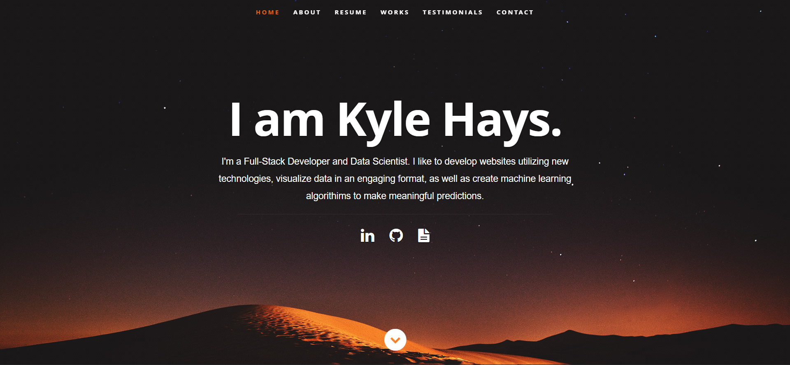

### Portfolio:

A Portfolio built with React. Used to showcase my work, testimonials, Projects and other information with recruiters.

## Preview

### [Link to portfolio](https://cruddyshad0w.github.io/Portfolio/)

## How to use

1. Clone/Download the repo.
2. Run `npm install`.
3. Change the values in `src/resumeData.js`, `public/images`, and `public/files` to suit your use-case.
4. Run `npm start` to spin the up the local dev server port 3000.(http://localhost:3000).
5. May need an `npm audit` depending on package updates.

### Deployment

1. Change the `homepage` value in `package.json` to link to your repo's github.io page `“homepage”: “http://{Github-username}.github.io/{Github-repo-name}"`
2. Open the terminal and run command `npm run deploy` to create a gh-pages branch and deploy the website from this branch.
3. Activate GitHub pages in the repository settings to deploy from gh-pages branch if necessary.

[deployment instructions source](https://medium.com/mobile-web-dev/how-to-build-and-deploy-a-react-app-to-github-pages-in-less-than-5-minutes-d6c4ffd30f14)
